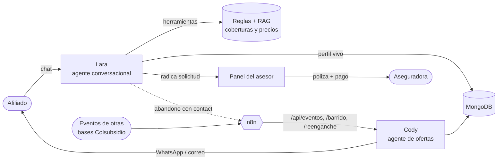

<div align="center">

# Lara & Cody · Venta automatizada de seguros

**Reto 2 · Seguros** — Hackathon **[Colsubsidio × 30X](https://innovacion.colsubsidio.com/)** · Bogotá, julio de 2026

Dos agentes de IA que llevan a cada afiliado desde *«no sé qué seguro necesito»* hasta *«ya quedé asegurado»* — de forma explicable, trazable y sin cajas negras.

### **[📹Video/Pitch de Lara + Cody](https://youtu.be/JkOcqmdmccg)**
### **[💻 Demo en vivo](https://clara-production-d3e5.up.railway.app)**

| [💬 Hablar con Lara](https://clara-production-d3e5.up.railway.app/#demo) | [⚡ Panel de Cody](https://clara-production-d3e5.up.railway.app/ofertas) | [🗂️ Panel del asesor](https://clara-production-d3e5.up.railway.app/asesor) |
|:--:|:--:|:--:|


</div>

---

## 📖 Índice

1. [El reto y nuestra solución](#-el-reto-y-nuestra-solución)
2. [Los dos agentes](#-los-dos-agentes)
3. [Arquitectura](#️-arquitectura)
4. [Lara — la asesora conversacional](#-lara--la-asesora-conversacional)
5. [Cody — el agente de ofertas proactivo](#-cody--el-agente-de-ofertas-proactivo)
6. [Panel del asesor](#️-panel-del-asesor)
7. [Orquestación con n8n](#-orquestación-con-n8n)
8. [Stack técnico](#-stack-técnico)
9. [Estructura del proyecto](#-estructura-del-proyecto)
10. [API principal](#-api-principal)
11. [Cómo ejecutarlo](#-cómo-ejecutarlo)
12. [Datos, alcance y privacidad](#-datos-alcance-y-privacidad)
13. [Equipo](#-equipo)

---

## 🎯 El reto y nuestra solución

**El reto (Colsubsidio × 30X · Seguros):** automatizar la venta y el acompañamiento de seguros para los afiliados de Colsubsidio, de punta a punta.

**Nuestra solución** son **dos agentes de IA que se complementan**, orquestados por **n8n**:

- **Lara** atiende a quien llega a conversar: entiende su necesidad, lo identifica en la base de afiliados, recomienda con respaldo documental y prepara todo para el cierre.
- **Cody** trabaja *solo*, sin esperar a nadie: reacciona a eventos de las bases de Colsubsidio (y a conversaciones que quedaron a medias) para enviar la oferta de seguro pertinente por el canal correcto.

Un principio guía todo el sistema: **el modelo pone las palabras, las reglas ponen la verdad.** Ningún precio, cobertura ni recomendación sale de una alucinación del LLM — todo proviene de reglas auditables y de datos verificables.

> **Colsubsidio distribuye seguros, no los emite.** Por eso los agentes **nunca cobran ni emiten pólizas**: preparan el caso completo y un **asesor humano** finaliza la vinculación con la aseguradora. Esa transparencia está incorporada en el flujo.

---

## 🤝 Los dos agentes

|  | **Lara** · agente conversacional | **Cody** · agente proactivo |
|---|---|---|
| **Cuándo actúa** | Cuando la persona escribe | Solo, ante eventos o abandonos (vía n8n) |
| **Qué hace** | Identifica al afiliado, diagnostica, recomienda con respaldo, arma el perfil y radica la solicitud | Detecta un cambio o una charla sin cerrar y envía la oferta de seguro pertinente |
| **Enfoque** | Todo el portafolio de seguros, afiliado-first | **100 % seguros**, con reglas evento → seguro |
| **Garantías** | No inventa precios ni coberturas; identifica antes de asesorar | No repite ofertas (anti-spam) ni molesta sin motivo |
| **Salida** | Perfil + conversación para el asesor humano | Recordatorio/oferta por WhatsApp o correo |

**La unión de los dos:** si alguien conversa con Lara, deja su contacto y **no cierra**, Cody lo detecta y le envía un recordatorio de *su* seguro — «aún puedes gestionarlo». Nadie empieza de cero y nadie recibe spam.

---

## 🏗️ Arquitectura



- **Backend:** una sola app **FastAPI** expone a Lara, a Cody y al panel del asesor.
- **Cerebro:** **Google Gemini** conversa y decide *qué herramienta* llamar; el backend ejecuta la lógica de forma determinística.
- **Memoria:** **MongoDB** guarda el *perfil vivo* (lo que el sistema aprende de cada persona), las sesiones, las solicitudes y las ofertas.
- **Orquestación:** **n8n** dispara a Cody por eventos, por un barrido programado y por el re-enganche de abandonos.
- **Despliegue:** **Railway** (app + MongoDB), con el catálogo de demo sembrado automáticamente al arrancar.

---

## 🧠 Lara — la asesora conversacional

Lara está diseñada para razonar en un orden claro y **explicable**:

1. **Identificación primero (afiliado-first).** Antes de asesorar, Lara establece *quién es la persona*: pregunta si es afiliada, verifica su **SERIE** contra la base real (MongoDB) y ancla su **perfil 360** (vivienda, créditos, propensión). Si no es afiliada, la registra igual para no perder el contexto.
2. **Diagnóstico o atajo.** Si la persona ya sabe qué quiere, va directo; si no, un diagnóstico con preguntas abiertas, una por turno.
3. **Recomendación con respaldo.** Cada opción muestra su **aseguradora** (p. ej. Seguros Bolívar, Sura), qué cubre, qué no, y el precio **siempre como «desde $X/mes»** (referencial; el valor final lo fija el asesor con la aseguradora).
4. **Cierre sin emitir.** Cuando a la persona le gusta una póliza, Lara genera un **PDF informativo**, pide nombre + identificación + contacto y **radica el caso al asesor**. No cobra, no firma, no emite.

**Barreras contra la alucinación (las reglas de oro):**
- Las coberturas salen de **RAG documental** — Lara no inventa amparos.
- Los precios salen de un **motor de reglas** determinístico — el modelo nunca calcula un precio.
- El motor de **propensión** rankea los productos por afinidad al perfil, con razones explicables.
- Cada decisión y cada llamada a herramienta quedan **auditadas**.

---

## ⚡ Cody — el agente de ofertas proactivo

Cody es un agente **100 % de seguros** que no espera al cliente. Su lógica es una regla `evento → seguro`, siempre con una razón explicable:

| Disparador | Ejemplo | Oferta |
|---|---|---|
| **Evento de otra base** | Crédito de vivienda desembolsado | Seguro de Hogar (+ Vida como cross-sell) |
| **Barrido autónomo** | Recorre una muestra de la base | El mejor seguro por **propensión** |
| **Abandono con contacto** | Habló con Lara y no cerró | **Recordatorio** de su seguro |

Con dos guardrails que protegen la experiencia:

- 🔁 **Anti-spam:** no repite el mismo seguro al mismo perfil en 15 días.
- 🎯 **Pertinencia:** cada oferta se elige por regla o propensión, nunca al azar.

El **panel de Cody** (`/ofertas`) permite verlo trabajar en vivo: ejecutar un barrido sobre la base, activar la *demo automática*, simular un evento puntual y ver cómo razona (contadores de *oferta pertinente*, *retomar a Lara* y *repetición evitada*).

---

## 🗂️ Panel del asesor

Como Colsubsidio distribuye pero no emite, el cierre lo hace un **asesor humano**. El panel (`/asesor`) le entrega, por cada solicitud:

- La **conversación completa** que la persona tuvo con Lara (en burbujas de chat).
- Sus **datos de contacto**, el **seguro que busca** y las **aseguradoras** disponibles.
- Un **filtro** por estado y **búsqueda** por nombre.
- La acción para **enviar la póliza y el link de pago** y avanzar el estado hasta el cierre con la aseguradora.

---

## 🔗 Orquestación con n8n

Tres workflows conectan el ecosistema (todos llaman a la app vía la variable `CLARA_BASE_URL`):

| Workflow | Disparador | Qué hace |
|---|---|---|
| `agente-ofertas` | Webhook / cron diario | Evento → `POST /api/eventos`; barrido → `POST /api/ofertas/barrido` |
| `agente-reenganche` | Cron (cada 30 min) | Re-engancha abandonos → `POST /api/ofertas/reenganche` |
| `agente-actualizacion` | Webhook | Actualiza el afiliado en Mongo y re-evalúa sus ofertas |

Los JSON de los workflows están en [`n8n/`](n8n/) listos para importar. La inteligencia vive en la app; n8n solo agenda y transporta.

---

## 🧰 Stack técnico

| Capa | Tecnología |
|---|---|
| **API / backend** | FastAPI 0.115 · Uvicorn · Pydantic 2 |
| **LLM** | Google Gemini (AI Studio, `gemini-flash-latest`) con function-calling |
| **Base de datos** | MongoDB (perfil vivo, sesiones, solicitudes, ofertas) · driver PyMongo 4 |
| **Orquestación** | n8n (workflows por evento, cron y webhook) |
| **Documentos** | fpdf2 (PDF informativo de la póliza) |
| **Datos base** | openpyxl (ETL de la base de afiliados) |
| **Despliegue** | Docker · Railway (app + MongoDB gestionado) |

---

## 📁 Estructura del proyecto

```
app/
  main.py            API FastAPI: Lara, Cody, asesor, pagos
  agent.py           Cerebro conversacional de Lara (herramientas + guardrails)
  ofertas.py         Cody: reglas evento -> seguro (100% seguros)
  knowledge.py       Catálogo de seguros, coberturas, precios y aseguradoras
  propension.py      Motor de propensión explicable (afinidad por perfil)
  afiliados_db.py    Acceso a la base real de afiliados (perfil 360) en Mongo
  store.py           Persistencia en Mongo: sesiones, perfil vivo, solicitudes, ofertas
  seed.py            Siembra automática de la muestra demo
  llm.py             Cliente Gemini/Anthropic (con respaldo)
  pdfgen.py          Generación de PDFs
  config.py          Configuración por variables de entorno
static/              Interfaces: Lara (/), Cody (/ofertas), asesor (/asesor)
n8n/                 Workflows de orquestación (importables)
scripts/             ETL de la base de afiliados a Mongo (cargar_mongo.py)
Dockerfile           Imagen de producción
```

---

## 🔌 API principal

| Método | Ruta | Descripción |
|---|---|---|
| `POST` | `/api/session` · `/api/chat` | Conversación con Lara |
| `GET` | `/api/afiliados/{serie}` | Perfil 360 del afiliado |
| `PATCH` | `/api/afiliados/{serie}` | Actualiza el afiliado (usado por n8n) |
| `POST` | `/api/eventos` | Dispara a Cody con un evento |
| `POST` | `/api/ofertas/barrido` | Barrido autónomo sobre la base |
| `POST` | `/api/ofertas/reenganche` | Re-enganche de abandonos |
| `GET` | `/api/asesor/solicitudes` | Bandeja del asesor |
| `GET` | `/api/health` | Estado del servicio y del LLM |

Con la app corriendo en local, la documentación interactiva está en `/api/docs`.

---

## 🚀 Cómo ejecutarlo

### Requisitos
- Python 3.12+ y un **MongoDB** accesible.
- Una **API key de Google Gemini** (AI Studio).

### Local
```bash
# 1. Dependencias
pip install -r requirements.txt

# 2. Configuración — crea un archivo .env con:
#    GEMINI_API_KEY=tu_clave_de_ai_studio
#    LLM_PROVIDER=aistudio
#    GEMINI_MODEL=gemini-flash-latest
#    MONGODB_URI=mongodb://localhost:27017
#    MONGODB_DB=colsubsidio

# 3. Ejecutar
python server.py          # o: uvicorn app.main:app --reload
# App en http://localhost:8000
```

Al arrancar, si la base está vacía, la app **siembra automáticamente** una muestra de demo (afiliados, abandonos y solicitudes con conversación) para que todo funcione al instante.

> Para cargar la base real de afiliados a Mongo:
> `python scripts/cargar_mongo.py "ruta/al/archivo.xlsx" --reset` (opcional `--limit=N` para una muestra menor).

### Producción
Imagen **Docker** lista (`Dockerfile`). El despliegue de la demo corre en **Railway** con MongoDB gestionado y el modelo de Gemini como variable secreta.

---

## 🔒 Datos, alcance y privacidad

- **Prototipo demostrativo.** El catálogo de productos, las **aseguradoras**, los **planes** y los **precios** son **simulados/ilustrativos** para el reto — no son datos oficiales de Colsubsidio ni de las aseguradoras. La cotización y la póliza reales las confirma un asesor.
- **Base de afiliados.** La base real anonimizada tiene ~500.000 registros (identificados solo por SERIE, sin nombres ni cédulas). El despliegue de la demo usa una **muestra sintética sembrada** para no exponer datos reales.
- **Precios referenciales.** Siempre se presentan como *«desde $X/mes»*; el valor final lo define el asesor con la aseguradora.
- **Colsubsidio distribuye, no emite.** Los agentes nunca cobran ni emiten pólizas.
- **Habeas data.** Los datos se tratan conforme a la **Ley 1581 de 2012**; el aviso de tratamiento se da al inicio de cada conversación.

---

## 👥 Equipo

> ## 🏴‍☠️ Equipo **BusterCall**

| Integrante | GitHub |
|---|---|
| **Mariana Sinisterra** | [@MarianaCodebase](https://github.com/MarianaCodebase) |
| **Michael Daniel** | [@MaicolD0930](https://github.com/MaicolD0930) |
| **Jorge Martínez** | [@JorgeAMS](https://github.com/GeorgeAMS) |

<div align="center">

Hecho para el **Hackathon Colsubsidio × 30X** · Bogotá, julio de 2026

**[▶️ Probar la demo](https://clara-production-d3e5.up.railway.app)**

</div>
